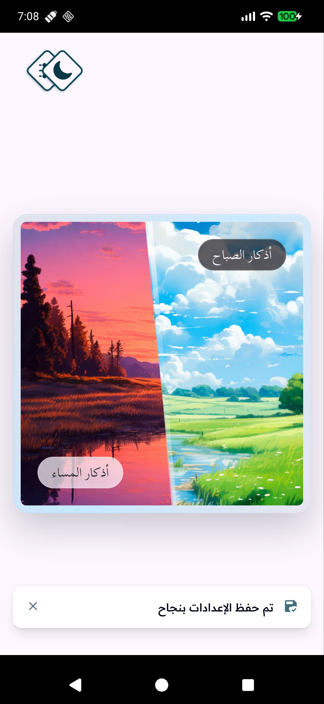
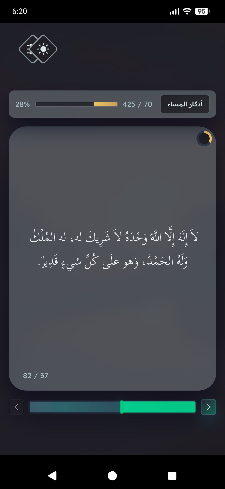
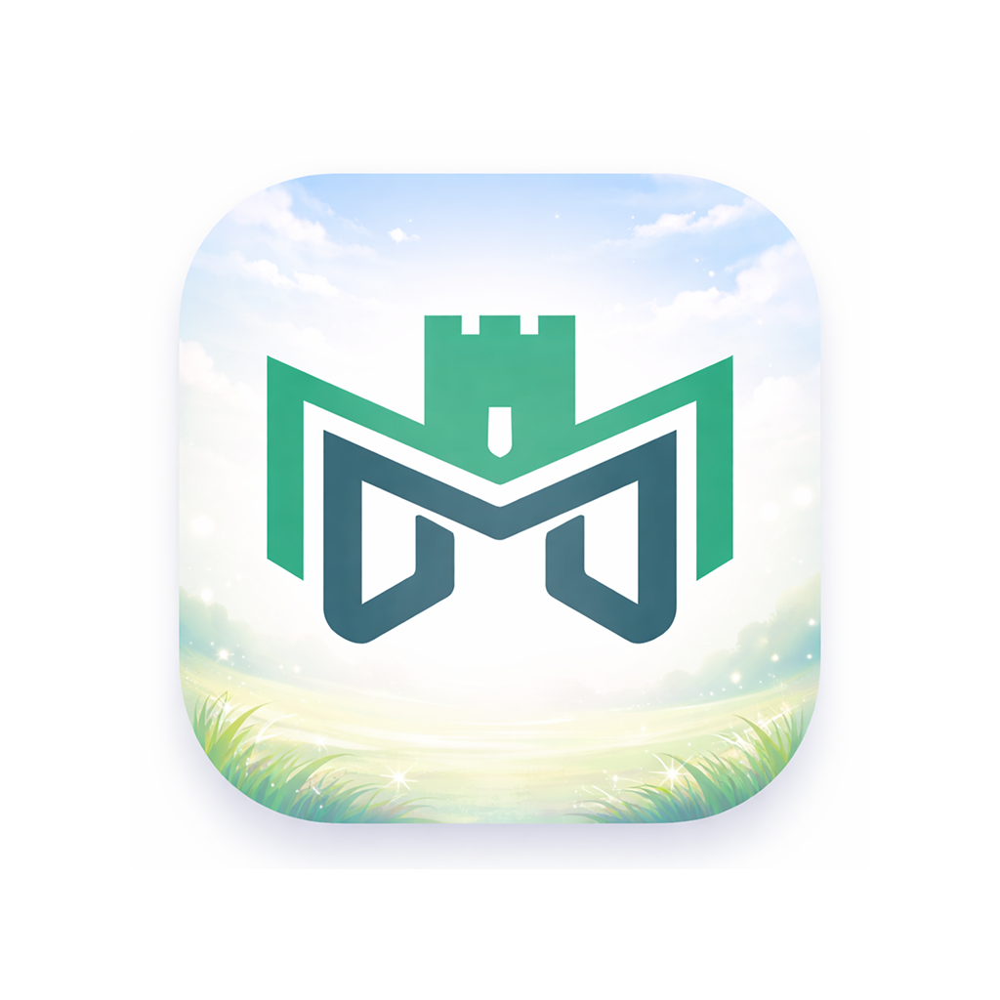
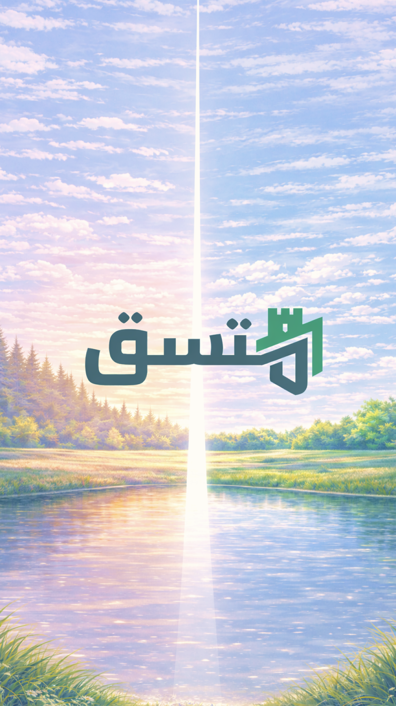

بسم الله الرحمن الرحيم

# متسق

تطبيق يهدف للاتساق مع الإسلام لله رب العالمين، خطوة بخطوة، وبيسر وسهولة بإذن الله. تطبيق بترميز واحد لكل المنصات، مصنوع بتقنات حديثة، ومصمم بواجهة جذابة؛ ولا حول ولا قوة إلا بالله...

أفكار المشروع مستعرضة عن طريق فيديو في [منشور التليجرام](https://t.me/tiqaniy/29) هذا:  

### المتصفح

لتجرية التطبيق الآن من أي متصفح: 
https://muttasiq.com

  

### الأندرويد

قريبًا، بإذن الله... (الشرح في فيديو التليجرام [في الأعلى](#متسق))

&nbsp;&nbsp;

## المهام

لاقتراح أي فكرة أو مناقشة أي خاصية حالية للتطبيق، يرجى طرحها -**لا في قسم [المشكلات التقنية](https://github.com/GoodM4ven/NATIVE_TALL_muttasiq-dot-com/issues)**- بل في قسم [النقاشات](https://github.com/GoodM4ven/NATIVE_TALL_muttasiq-dot-com/discussions)، جزاكم الله خيرا، والسلام.

### المحرك
- ~~ترزميز واحد لتصدير تطبيق لجميع المنصات~~
- ~~حافظة محلية لإنجازات وإعدادات المستخدم~~
- ~~اختبارات برمجية لتطبيق الويب (المتصفح)~~
- اختبارات برمجية لتطبيقات المنصات (المحلية)
- قسم لاستعراض المهام والمتغيرات بين النسخ
- محرك للغة العربية، بحثا وتحليلا
- إخفاء الحركات
- القراءة بالعربية صوتيا
- دعم اللغات الأجنبية بشكل مفتوح المصدر

### الانطلاق
- ~~أذكار الصباح والمساء~~

### التحديث الأول
- تذكير بأذكار الصباح والمساء
- أذكار يوم الجمعة
- إمكانية تعديل الأذكار وترتيبها

### التحديث الثاني
- الصلوات وتذكيراتها
- قضاء الصلوات أيام ضلال المرء
- سنة الاستهام

### التحديث الثالث
- صلة
- صحيح الأدعية، مقسمة بأنواع الاحتياجات

### التحديث الرابع
- القرآن الكريم
- الورد اليومي من القرآن الكريم

### التحديث الخامس
- سنن اليوم والليلة
- اصطياد كل السنن بآثارها، ولو مرة في العمر

### التحديث السادس
- علم الحديث: إسناد ورواة ومتون
- إمكانية جرد الآثار باتساق

## الدعم

كما تعلم، بارك الله فيك، فجعل التطبيق متاحًا على المخدمات، ومتوفرا في كافة المنصات (بأنواع أجهزتها المختلفة) وبيسر وسهولة، يحتاج إلى طاقة ومال وفيرين! وتطوير كل هذه الإمكانيات يأخذ تخطيطا بوقت كثير وبذل جهد كبير، وعلى حساب أي عمل أو صنعة أخرى... فلا تنسانا من الدعاء.

وكذلك تستطيع دعم تطوير وصيانة المشروع هذا عن طريق الاشتراك ([بمبلغ شهري](https://github.com/sponsors/GoodM4ven))، أو عن طريق التبرع [لمرة واحدة](https://github.com/sponsors/GoodM4ven?frequency=one-time&sponsor=GoodM4ven)، وذلك في المنصات التالية:

- [جيتهاب | Github](https://github.com/sponsors/GoodM4ven)
- [باتريون | Patreon](https://patreon.com/GoodM4ven)
- [باي مي كوفي | BuyMeCoffee](https://buymeacoffee.com/goodm4ven)

وإن كنت مطورًا أو مصمّما، وتودّ دعم هذا المشروع، فقم بتفقد القسم المخصص في الأسفل.

والله المستعان.

### الداعمون

- [قناة الرقية الشرعية](t.me/Ruqyah011) (لأبي عمر، يوسف)

 

# Development

The web app is built using one of the most standard and well-documented web technology stacks, known as the [TALL stack](https://tallstack.dev). As for the native app is built using [NativePHP](https://nativephp.com)’s new mobile builder, which relies on a wide ecosystem of technologies—without requiring direct interaction with them.

Any changes to the `main` branch is going to **directly update the web app**.

**Therefore, PRs are NOT going to be directed to `main` branch, but rather to `dev` branch, please!**

## Coding

### General

- [lara-stacker](https://github.com/GoodM4ven/CLI_LARAVEL_lara-stacker) can be used for readying up your Ubuntu as a solid development environment.
- [favycon](https://github.com/ruisaraiva19/favycon) is what had been used to generate all the possible favicon sizes, and their meta links, that were put in [favicon.blade.php](./resources/views/partials/favicon.blade.php) partial view.
- [TALL-STANDARDS](https://github.com/GoodM4ven/WIKI_WEB_tall-standards) wikipedia contains a decent bit of tips for dealing with the tall-stack and some other related tools and technologies. (The project isn't complete)

### Native

If you have experience with [Kotlin](https://kotlinlang.org/) or [Swift](https://www.swift.org/), [electronJS](https://www.electronjs.org/) is communicating with them under the hood in [NativePHP](https://nativephp.com). You can implement those changes as PHP [plugins](https://nativephp.com/plugins) of course, and even make them paid to support yourself!

So if you're really up to it, take a look at our [missions](#المهام) above and see if you can implement the native features needed.

## Design

If you're a designer, or perhaps you don't know much about coding, feel free to post in [discussions](https://github.com/GoodM4ven/NATIVE_TALL_muttasiq-dot-com/discussions) any contributions to how you think visuals can be improved; supported by photos and videos, of course.

The icon is set to be 1024x1024 pixels:

 

As for the splash screen, it has to be a portrait 1080x1920 pixels:

> [!TIP]
> There is light and dark themed splash screen feature, but I'm not currently utilizing it because of the current poor brand anyway...

The assets used for the app so far can be found in this [Penpot](https://penpot.app) file: 
[Design.penpot](./.assets/design.penpot)

## Resources

- [https://heropatterns.com](https://heropatterns.com)
- [https://blade-ui-kit.com/blade-icons](https://blade-ui-kit.com/blade-icons)
- [https://laravel-package-ocean.com](https://laravel-package-ocean.com)
- [https://filamentphp.com/plugins](https://filamentphp.com/plugins)
- [https://nativephp.com/plugins](https://nativephp.com/plugins)

## Credits

### Contributors

- [GoodM4ven](https://github.com/GoodM4ven) (أبو عبد الله الحاسوبي)

### Assets

احذر 
ذوات 
الأرواح

- [Morning athkar background](https://www.freepik.com/free-ai-image/beautiful-anime-landscape-cartoon-scene_94944933.htm#fromView=search&page=3&position=17&uuid=7fbc119d-abf3-4f15-b3b3-7073afb85ff8&query=Anime+nature+wallpaper+day)
- [Night athkar background](https://www.freepik.com/free-ai-image/digital-art-isolated-house_93658018.htm#fromView=search&page=1&position=36&uuid=7fbc119d-abf3-4f15-b3b3-7073afb85ff8&query=Anime+nature+wallpaper+day) (modified via ChatGPT)

### Technologies
- [ChatGPT](https://chatgpt.com) and [Codex CLI](https://developers.openai.com/codex/cli/)
- [Laravel](https://laravel.com) entire ecosystem
- [TALL-Stack](https://tallstack.dev)
- [FilamentPHP](https://filamentphp.com)
- [NativePHP](https://nativephp.com)
- [VSCodium](https://vscodium.com) (the project was removed and then recovered, file by file, using tons of versions for each file from **the no-telemetry cache**)

 

والحمد لله رب العالمين

