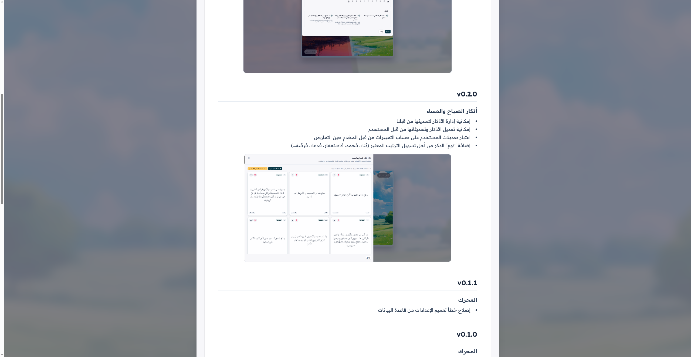
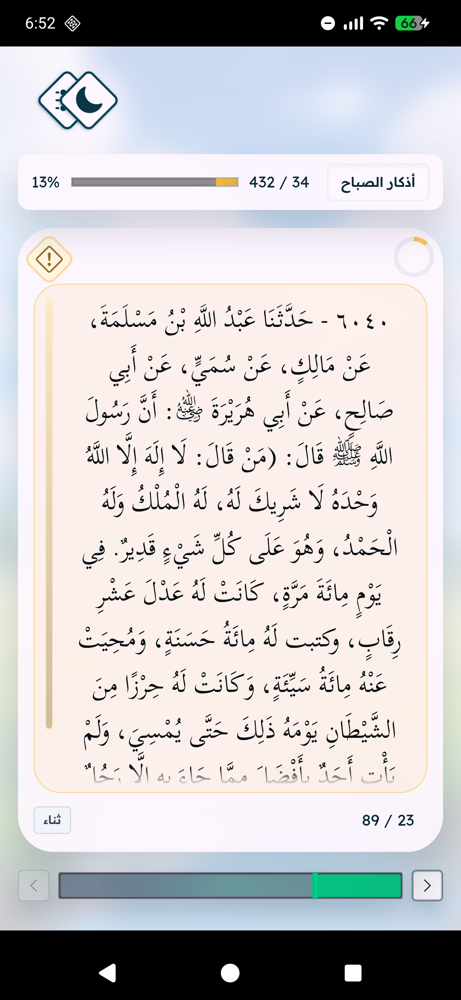
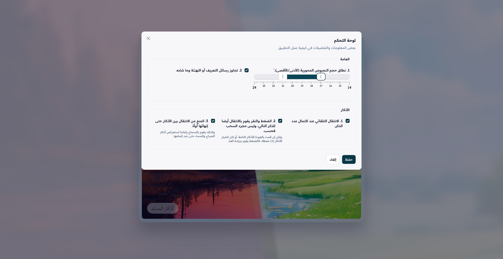
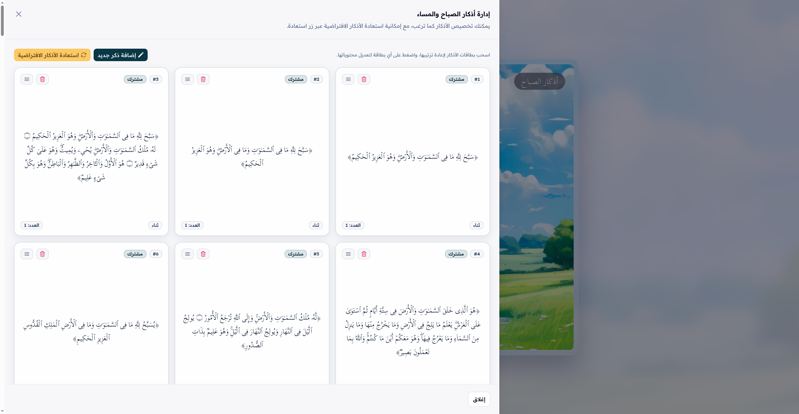
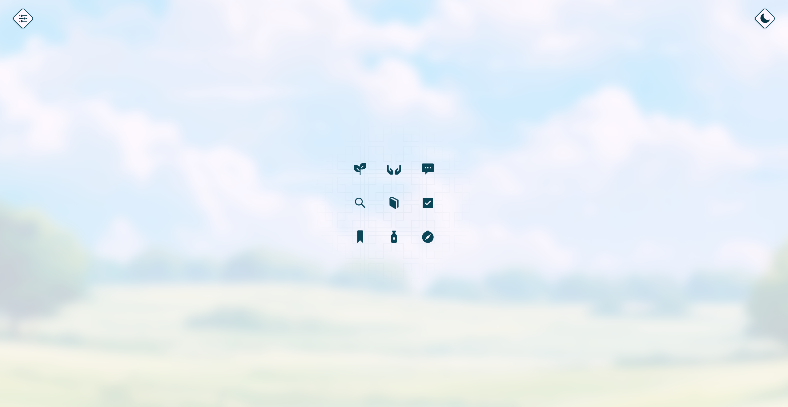
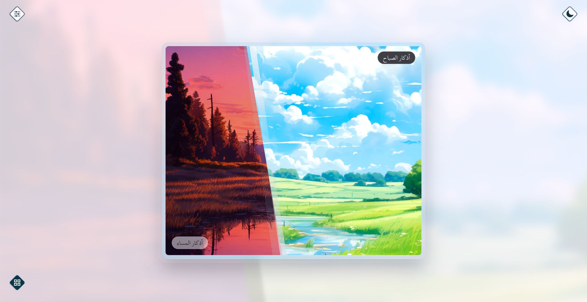
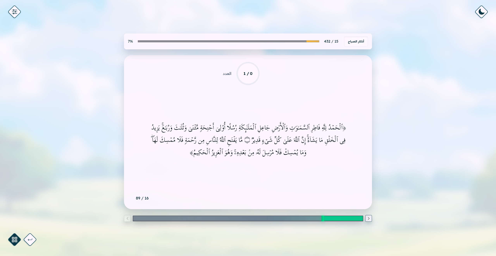

## v0.5.0

### المحرك

- مستعرض للتحديثات داخل التطبيق
- مستعرض للمعلومات حول التطبيق بروابط خارجية
- إضافة شريط مختف أسفل الشاشة لنسخة التطبيق الحالية والانتقال لإظهار التحديثات

## [v0.4.0](https://github.com/GoodM4ven/NATIVE_TALL_muttasiq-dot-com/pull/70)

### المحرك

- تعديل أحجام الخطوط المتاحة (التي يمكن التحكم بها من الإعدادات) لمناسبة شاشات أكثر واعتبار الصحة البصرية بإذن الله

## [v0.3.0](https://github.com/GoodM4ven/NATIVE_TALL_muttasiq-dot-com/pull/64)

### المحرك

- إمكانية التحكم في حجم الخط للنصوص المحورية (كالأذكار وآثارها)

## [v0.2.0](https://github.com/GoodM4ven/NATIVE_TALL_muttasiq-dot-com/pull/35)

### أذكار الصباح والمساء

- إمكانية إدارة الأذكار لتحديثها من قبلنا
- إمكانية تعديل الأذكار وتحديثاتها من قبل المستخدم
- اعتبار تعديلات المستخدم على حساب التغييرات من قبل المخدم حين التعارض
- إضافة "نوع" الذكر من أجل تسهيل الترتيب المعتبر (ثناء، فحمد، فاستغفار، فدعاء، فرقية...)
- إتاحة إضافة الأثر المسند بالنسبة للذكر، وإظهار علامة لعرض "المأثور" أثناء القراءة

## [v0.1.1](https://github.com/GoodM4ven/NATIVE_TALL_muttasiq-dot-com/pull/4)

### المحرك

- إصلاح خطأ تعميم الإعدادات من قاعدة البيانات

## [v0.1.0](https://github.com/GoodM4ven/NATIVE_TALL_muttasiq-dot-com?tab=readme-ov-file#%D9%85%D9%8F%D8%AA%D9%91%D9%8E%D8%B3%D9%90%D9%82)

### المحرك

- ترميز واحد لجميع المنصات، وبقدرات محلية (تستغل قدرات الجهاز نفسه)
- قائمة رئيسة تحول على مختلف الأقسام المختلفة للتطبيق
- القدرة على حفظ آخر قسم تمت زيارته للرجوع إليه مباشرة عند إعادة تشغيل التطبيق
- القدرة على حفظ بيانات في التطبيق ذاته منفصلا عن المخدم والتطبيق في السحابة
- تصميم ليلي ونهاري، لراحة العين
- خيار لتجاوز المنبثقات الإرشادية

### أذكار الصباح والمساء

- [مجموعة من الأذكار](https://t.me/Ruqyah011/4730) المرتبة للصباح والمساء
- حفظ ما تمت قراءته خلال اليوم والليلة، حتى الزيادة في الذكر
- إعادة حساب تلقائية للأذكار من جديد عند بداية كل يوم
- بعض الإعدادات الخاصة بمستعرض الأذكار

